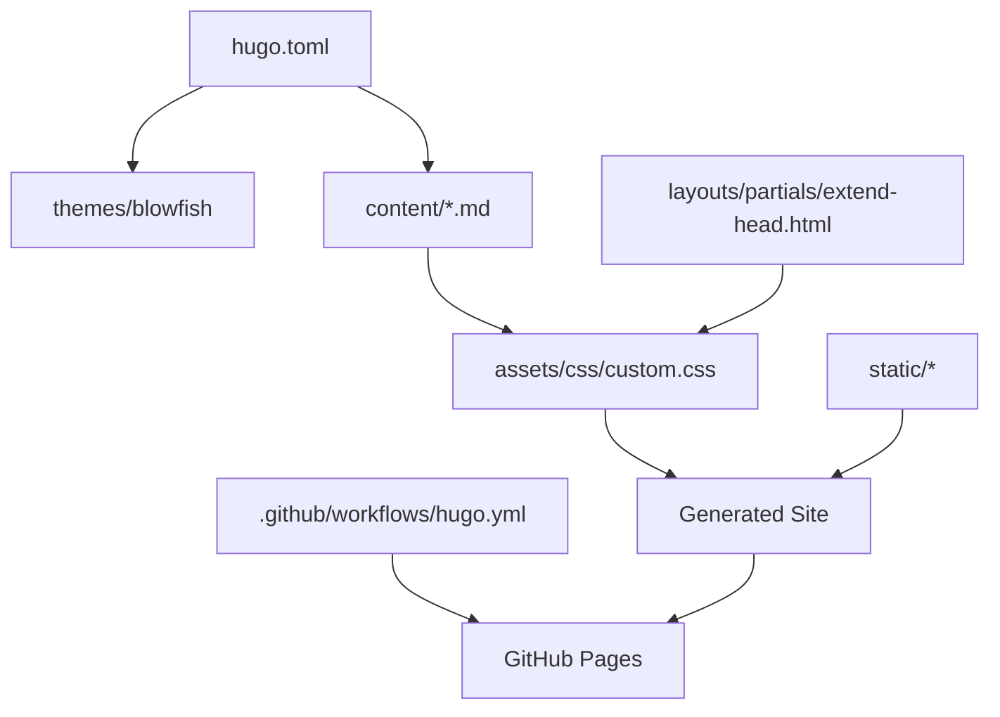

# Gemini Context: JavierMatasPose.github.io

> **Purpose:** This document provides comprehensive context for AI agents working on this repository. It covers architecture, design patterns, file structure, and development guidelines.

---

## 1. Project Overview

**Owner:** Javier Matas Pose — Medior AI Engineer  
**Purpose:** Personal portfolio website showcasing expertise in Generative AI, LLMs, Agentic AI, and Quantitative Finance.  
**Live URL:** https://javiermataspose.github.io/

### Design Aesthetic
The site follows a **"Vintage Synthwave Poster"** aesthetic inspired by 1980s American magazine advertisements:
- **High contrast color palette** (Red/Cream/Black)
- **Bold, retro typography** (Bungee for headlines)
- **Tactile interactions** via CSS transforms and animations
- **No JavaScript required** for core UI interactions (uses CSS "checkbox hack")

---

## 2. Tech Stack

| Component | Technology | Notes |
|-----------|------------|-------|
| **Static Site Generator** | Hugo v0.142+ | Fast builds, Go templates |
| **Theme** | Blowfish | Heavily customized |
| **Styling** | Vanilla CSS | CSS variables, Flexbox/Grid |
| **Fonts** | Google Fonts | Bungee, Roboto Slab, Anton, Libre Baskerville, Permanent Marker |
| **Hosting** | GitHub Pages | Automatic deployment via GitHub Actions |
| **CI/CD** | GitHub Actions | `.github/workflows/hugo.yml` |

---

## 3. Directory Structure

```
JavierMatasPose.github.io/
├── .github/
│   └── workflows/
│       └── hugo.yml          # Deployment automation
├── archetypes/               # Hugo content templates
├── assets/
│   └── css/
│       └── custom.css        # ⭐ MAIN DESIGN SYSTEM (all custom styles)
├── content/
│   ├── _index.md             # Homepage (hero + footer)
│   ├── about.md              # About Me page (bio, experience, achievements)
│   └── projects/
│       └── _index.md         # Projects grid page
├── layouts/
│   └── partials/
│       └── extend-head.html  # Font preconnect links
├── static/
│   ├── JMLinkedin.jpg       # Profile photo
│   └── ResumeJavierMatas.pdf # Downloadable CV
├── themes/
│   └── blowfish/             # Base theme (submodule)
├── hugo.toml                 # Hugo configuration
├── GEMINI.md                 # This file (agent context)
└── README.md                 # Project readme
```

---

## 4. Key Files Reference

### `hugo.toml` — Site Configuration
Contains:
- Base URL and language settings
- Blowfish theme parameters (color scheme, search, appearance toggle)
- Author information (name, image, bio, social links)
- Navigation menu definitions
- Markdown renderer settings (unsafe HTML enabled)

### `assets/css/custom.css` — Design System (~785 lines)
**This is the most important file for styling changes.**

#### CSS Variables (Design Tokens)
```css
:root {
    --bg-red: #c9303e;           /* Primary background */
    --paper-yellow: #fff59e;     /* Text/accent color */
    --accent-mauve: #b08699;     /* Secondary accent */
    --ink-black: #1a1a1a;        /* Dark elements */
    --shadow-blue: #7a82f8;      /* Shadows/highlights */
    --shadow-deep: #5a5be2;      /* Deep shadows */
    --accent-blue-light: #AEEEEE;
    --accent-orange: #ffcc80;
}
```

#### CSS Organization (Sections)
1. **CSS Variables** — Design tokens
2. **Base Styles & Resets** — Body, HTML defaults
3. **Blowfish Theme Overrides** — Hide default elements, transparent backgrounds
4. **Header Navigation Styling** — Menu styling
5. **Global Layout & Centering** — Flexbox containers
6. **Shared Components** — `.vintage-container`, `.poster-header`, `.subtitle-tag`, `.clean-list`
7. **Homepage Hero Section** — `.hero-container`, `.home-title`, `.since-tag`
8. **About Me Page** — `.poster-layout`, `.photo-frame-retro`, `.bio-card`, `.experience-grid-retro`, expandable cards
9. **Projects Page** — `.projects-grid`, `.project-card`, `.ascii-art`, `.tech-stack-tag`
10. **Responsive Design** — Media queries for tablets/mobile
11. **Design Improvements** — Animations (`@keyframes wiggle`), enhanced buttons, vintage footer

### `content/_index.md` — Homepage
Structure:
```html
<div class="hero-container">
  <h1 class="poster-text home-title">THE FUTURE IS TODAI!</h1>
  <span class="since-tag">Engineering Intelligence since 2020</span>
</div>
<footer class="vintage-footer">...</footer>
```

### `content/about.md` — About Me Page
Features:
- **Two-column layout** (`.poster-layout`): sidebar with photo/bio, main with experience
- **Expandable experience cards** using CSS checkbox hack
- **Color-coded cards**: `.exp-card-purple`, `.exp-card-blue`, `.exp-card-orange`
- **Press/recognition section** (`.press-section`, `.press-grid`)

### `content/projects/_index.md` — Projects Page
Features:
- **Project grid** (`.projects-grid`)
- **ASCII art placeholders** in project cards
- **Tech stack tags** (`.tech-stack-tag`) with sticker effect
- **Expandable project details** using checkbox hack

---

## 5. Design Patterns & Conventions

### CSS "Checkbox Hack" for Interactivity
Used for expandable cards without JavaScript:
```html
<input type="checkbox" id="exp-cap" class="toggle-input">
<label for="exp-cap" class="paper-card">
    <h4>Title</h4>
    <div class="content-reveal">Hidden content...</div>
</label>
```
```css
.toggle-input { display: none; }
.content-reveal { max-height: 0; opacity: 0; transition: all 0.4s; }
.toggle-input:checked + .paper-card .content-reveal { max-height: 500px; opacity: 1; }
```

### Typography Hierarchy
| Element | Font | Usage |
|---------|------|-------|
| Main titles | `Bungee` | `.home-title`, `.main-title-about`, `.project-title` |
| Body text | `Roboto Slab` | Default body font |
| Serif accents | `Libre Baskerville` | Bio text, quotes |
| Decorative | `Permanent Marker` | `.since-tag` |
| Display | `Anton` | Specs titles |

### Shadow Pattern
Consistent layered shadows for depth:
```css
text-shadow: 6px 6px 0px var(--shadow-blue), 12px 12px 0px var(--shadow-deep);
box-shadow: 8px 8px 0px var(--ink-black);
```

### Animation Classes
- `@keyframes wiggle` — Subtle rotation wiggle on hover
- Transform effects on buttons/cards for tactile feedback

---

## 6. Development Workflow

### Local Development
```bash
# Start dev server with drafts
hugo server -D

# Build production site
hugo --minify
```

### Editing Content
1. Edit Markdown files in `content/`
2. **IMPORTANT:** Do NOT indent HTML tags in Markdown (causes rendering issues)
3. Use raw HTML with classes defined in `custom.css`

### Editing Styles
1. Modify `assets/css/custom.css`
2. Use CSS variables for colors (avoid hardcoded values)
3. Follow the section organization in the file

### Deployment
1. Commit and push to `main` branch
2. GitHub Actions automatically builds and deploys to GitHub Pages
3. Live site updates within 1-2 minutes

---

## 7. Common Tasks

### Adding a New Project
1. Add a new `<div class="expandable-wrapper">` block in `content/projects/_index.md`
2. Create ASCII art for the placeholder (optional)
3. Add tech stack tags with `.tech-stack-tag` class

### Adding a New Experience Entry
1. Add a new expandable block in `content/about.md`
2. Use appropriate color variant: `.exp-card-purple`, `.exp-card-blue`, or `.exp-card-orange`
3. Include date with `.date-tag` class

### Modifying the Color Palette
Edit CSS variables in `:root` block of `custom.css`:
```css
:root {
    --bg-red: #c9303e;      /* Change primary background */
    --paper-yellow: #fff59e; /* Change accent/text color */
    /* etc. */
}
```

---

## 8. Troubleshooting

| Issue | Cause | Solution |
|-------|-------|----------|
| Content not visible | Blowfish theme overrides | Add `!important` to CSS rules |
| HTML not rendering | Indented HTML in Markdown | Remove indentation from HTML tags |
| Layout broken on mobile | Missing media query | Add responsive rules in section 10 of CSS |
| Fonts not loading | Missing preconnect | Check `extend-head.html` |
| Animations not working | CSS specificity issue | Use more specific selectors |

---

## 9. File Dependencies



---

## 10. Best Practices for Agents

1. **Always use CSS variables** for colors — never hardcode hex values
2. **Check class usage** before removing CSS — search in all `content/*.md` files
3. **Test with `hugo server -D`** before committing
4. **Preserve the design aesthetic** — maintain the vintage poster look
5. **Keep HTML in Markdown unindented** — critical for proper rendering
6. **Follow the CSS section organization** — add new styles to appropriate sections
7. **Use `!important` sparingly** — only when overriding Blowfish theme defaults
